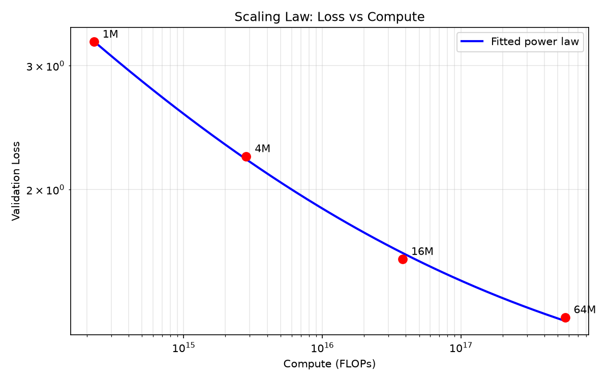

# Scaling Laws Experiment

Empirical verification of neural language model scaling laws (Kaplan et al. 2020, Hoffmann et al. 2022) at small scale using a from-scratch Transformer trained on TinyStories.

## Setup

- **Model**: Decoder-only Transformer (RoPE, SwiGLU, RMSNorm) built from scratch for Stanford CS336
- **Dataset**: TinyStories (2.1M stories, ~465M tokens tokenized with custom BPE, vocab=4096)
- **Training**: Chinchilla compute-optimal token budgets (20 tokens/param), cosine LR schedule with warmup, AdamW, fp16 mixed precision

## Experimental Design

Trained 4 model sizes targeting 1M, 4M, 16M, and 64M non-embedding parameters. FLOPs computed analytically from model shapes (not wall-clock time). Each size trained for `20 × N_non_embed` tokens following Chinchilla's compute-optimal ratio.

| Size | d_model | Layers | Non-embed Params | FLOPs | Val Loss |
|------|---------|--------|-----------------|-------|----------|
| 1M   | 96      | 8      | 1,033,824       | 2.26×10¹⁴ | 3.244 |
| 4M   | 128     | 19     | 4,051,840       | 2.83×10¹⁵ | 2.230 |
| 16M  | 256     | 20     | 16,066,816      | 3.80×10¹⁶ | 1.593 |
| 64M  | 384     | 35     | 64,539,264      | 5.65×10¹⁷ | 1.316 |

## Results

Fitted power law: `L = 5791.98 × C^{-0.237} + 0.939` (R² = 0.9992)

**Scaling exponent b = -0.237** vs Chinchilla's **b ≈ -0.050**



## Why the Exponent Diverges from Chinchilla

The fit is tight (R² = 0.9992) — loss follows a power law in compute — but the exponent is ~4.7× steeper than Chinchilla's. Three main reasons:

1. **Dataset complexity**: TinyStories is children's stories with extremely limited vocabulary and syntax. Models converge faster on simple distributions, making loss drop more steeply with compute than on diverse web text.
2. **Small vocab (4096 vs 50K+)**: Fewer output categories lower raw cross-entropy, compressing the loss range and steepening the apparent exponent.
3. **Scale range**: Chinchilla's regime was 70M–16B parameters. Power law exponents can shift across regimes; extrapolation to 1M–64M may not hold.

## Reproducing

```bash
pip install -r requirements.txt
python src/train.py 1M   # repeat for 4M, 16M, 64M
python src/fit.py
```
